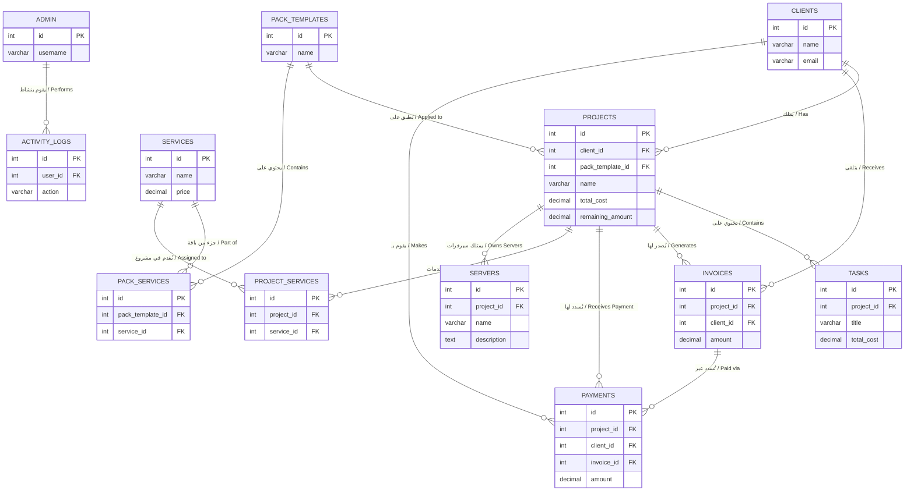

# الهيكلية البيانية لقاعدة البيانات (Entity-Relationship Diagram)

هذا الرسم يوضح بتبسيط كيف ترتبط الجداول ببعضها البعض داخل قاعدة بيانات نظام إدارة المشاريع.

### شرح مبسط للعلاقات:
1. **العميل (Clients) والمشاريع (Projects):** العميل الواحد يمكن أن يكون لديه عدة مشاريع **(علاقة 1 إلى متعدد)**.
2. **المشروع (Projects) والمهام (Tasks):** المشروع الواحد يُقسم إلى عدة مهام. ولدينا هنا **(Triggers)** تعمل آلياً بحيث أنه كلما زادت تكلفة مهمة، تزداد تكلفة المشروع بأكمله `total_cost`.
3. **الخدمات (Services)، الباقات (Pack Templates) والمشاريع:**
   - السيرفر يوفر خدمات مفردة.
   - يمكن تجميع هذه الخدمات في "باقة" (Pack Template).
   - المشروع يمكن أن يعتمد على "باقة" مسبقة الصنع أو خدمات فردية مخصصة.
4. **النظام المالي (الفواتير والمدفوعات):**
   - الفاتورة (Invoice) ترتبط بمشروع وعميل.
   - الدفعة (Payment) يمكن أن تُسدد فاتورة محددة، أو تُسدد جزءاً من تكلفة المشروع بشكل عام. بمجرد إضافة دفعة، يقوم الـ Trigger بتقليل `remaining_amount` للمشروع تلقائياً.
5. **لوحة التحكم (Admin):** تسجل كافة تحركات الإدارة وتُحفظ كـ (Activity Logs) مرتبطة بالـ (Admin ID).
