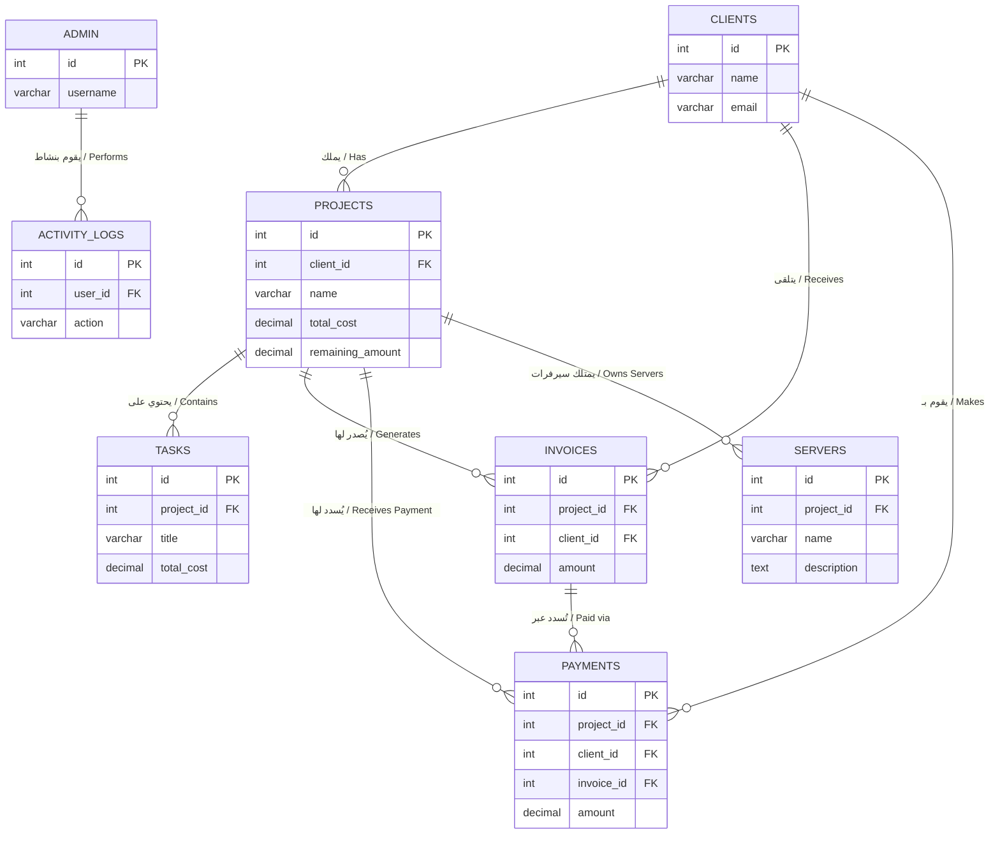

# الهيكلية البيانية لقاعدة البيانات (Entity-Relationship Diagram)

هذا الرسم يوضح بتبسيط كيف ترتبط الجداول ببعضها البعض داخل قاعدة بيانات نظام إدارة المشاريع بعد تبسيط النظام.

### شرح مبسط للعلاقات:
1. **العميل (Clients) والمشاريع (Projects):** العميل الواحد يمكن أن يكون لديه عدة مشاريع.
2. **المشروع (Projects) والمهام (Tasks):** المشروع الواحد يُقسم إلى عدة مهام. التكلفة الإجمالية للمشروع تحسب آلياً من مجموع تكاليف المهام المرتبطة به.
3. **النظام المالي (الفواتير والمدفوعات):** الفاتورة ترتبط بمشروع وعميل. الدفعة تقلل المبلغ المتبقي للمشروع وتحدث حالة الفاتورة.
4. **السيرفرات (Servers):** ترتبط المشاريع بسيرفرات لإدارتها تقنياً.
